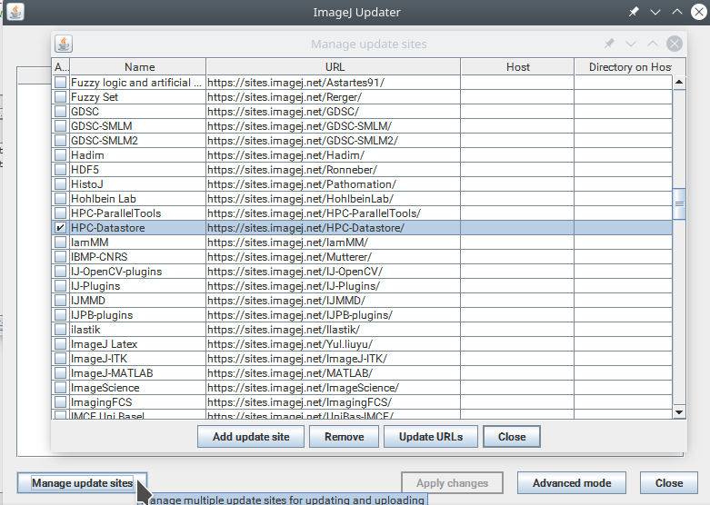

# HPC DataStore
This is the server-side of the HPC DataStore project.

The DataStore is shortest described as [BigDataServer](https://imagej.net/plugins/bdv/server)
that can also accept images besides serving them. In other words, it is a [REST](https://en.wikipedia.org/wiki/Representational_state_transfer)
HTTP-based client-server for downloading/uploading chunks from images from/to a remote dataset.
The server is storing image data using the [N5](https://github.com/saalfeldlab/n5) on disk
in a [BigDataViewer](https://imagej.net/plugins/bdv) unique [XML/N5 dialect.](doc/DESCRIPTION.md#the-bdv-dialect)
The server communicates with its clients using [our own simple protocol.](https://docs.google.com/document/d/1ZeLc83dyNE9USBuvSCLEVGK-zQzUKFb7VGhOlVIRBvU/edit)

[Motivation](doc/HISTORY.md) as well [some reasoning, application examples and more
details in general can be found here.](doc/OUTLINE.md)

## [Table of contents is here.](doc/OUTLINE.md)

## Notes that shall not be overlooked...
Folks, this is a young project. Still quite a few things are "under heavy development".
Also the functionality of the [reference Fiji client](https://github.com/fiji-hpc/hpc-datastore-fiji)
is often a bit lacking behind what the server currently can do. But the future is bright :-)

At this moment, this is not [Zarr](https://zarr-specs.readthedocs.io/en/core-protocol-v3.0-dev/)
compatible. Sadly! We, however, wish and plan to be. It requires to switch to N5
[Zarr backend](https://github.com/saalfeldlab/n5-zarr), which we will do once the
BigDataViewer will be able to read Zarr files directly on disk (where we also plan
to be active and help) -- we want to preserve [the current access scheme](doc/DESCRIPTION.md#storage-architecture).
Everything needs its time, you know.

Main author: [Jan Kožusznik](https://github.com/kozusznik)

Contact person: Vladimir Ulman, <vladimir.ulman@vsb.cz>

## Technicalities
This repository hosts implementation of the *DatasetsRegisterService*
and *DatasetServer*, as [discussed here](doc/DESCRIPTION.md#connection-scheme).

The repository recognizes three types of branches:

- `production` branch hosts the last release version of the code,
- `master` branch hosts the current development, the `production` branch adjoins `master` from time to time,
- topic branch(es) host particular piece of development, it spins-off from the `master` and merges back.

# Starting the server
To make the DataStore act truly as [an image file format on its own](doc/APPLICATIONS.md#a-storage-independent-image-fileformat)
with no compromise in performance, it is advisable to operate one's own DataStore server.
In what follows is precisely how to do it.

## From command line
The easiest way to get the server up and running is to execute the following:

```
git clone https://github.com/fiji-hpc/hpc-datastore.git
cd hpc-datastore
git checkout -b production origin/production
./mvnw clean package
(on Windows: mvnw.cmd clean package)
./start-server
```

This downloads the recent sources, compiles them (also downloads dependencies which
will take some time) and runs the starting script. The starting script will only
print out help and ask you to provide path to where datasets shall be stored, hostname
and port to which the server shall bind to (where it should listen at).

(There used to be a period of time when Fiji client and this server was out-of-sync,
this is no longer truth and one can/should be using the latest code from the client(s) and server.)

The server is for real started with the following command:
```
./start-server PATH HOST PORT
```
One can (re)start the server on a folder with some datasets already inside,
the server will be serving them too.

One probably want to execute that inside a `screen` or `tmux` environment.

## From IDE
Run the class _cz.it4i.fiji.datastore.App_. It accepts the following properties:

- datastore.path
- quarkus.http.port
- quarkus.http.host
- datastore.ports

You can pass them as a parameter to the JVM with the `-D<property.name>` construct.
The last parameter (`datastore.ports`) is currently not used.

# Public testing server
We are running a demo server for testing it out. Please, be nice to it :-) (don't upload tons of data).
The server is hosting, among other, a dataset that shows the first 11 time points of a
[TRIF training video 02](http://celltrackingchallenge.net/3d-datasets/)
from the [CellTrackingChallenge.net](http://celltrackingchallenge.net/).
We thank the challenge organizers for kindly agreeing to use their data.

The access parameters are:

- server hostname and port: `alfeios.fi.muni.cz:9080`
- dataset id: `bd2e4ae0-64bb-48d7-8154-1c9846edbff6`

## Testing it with BigDataViewer
To test it out, [navigate your BigDataViewer](doc/APPLICATIONS.md#bdv-mastodon-and-friends),
which comes with [Fiji](https://imagej.net/software/fiji/downloads), on that particular dataset.
The outcome could look like this:


Choose browsing of BigDataServer, use `http://alfeios.fi.muni.cz:9080/bdv/bd2e4ae0-64bb-48d7-8154-1c9846edbff6`
for the remote url, choose the version 0, and the BigDataViewer window should show up.

## Testing it with Fiji Client
Or, try to download one or more images from the DataStore:


Here, [have *HPC-DataStore* update site installed in your Fiji](doc/imgs/datastore-fiji-update-site.png),
then start *Request Dataset Serving* in the *HPC DataStore* menu, provide the access information (left dialog window),
convenience dialog (right window) shows up that aids and guards the user when changing the dialog items. Eventually,
the requested image (or its sub-region based on what chunks are requested) gets downloaded. Notice the ImageJ macro
command reported for exactly that operation. One could cut-and-paste it as such or as a template into own macros.

Again, the *HPC-DataStore* Fiji update site should be enabled to obtain the client plugins:



## Start with Importing Own Dataset
[...and here's how.](doc/HOWTO.md#creating-from-an-existing-hdf5-xml)
