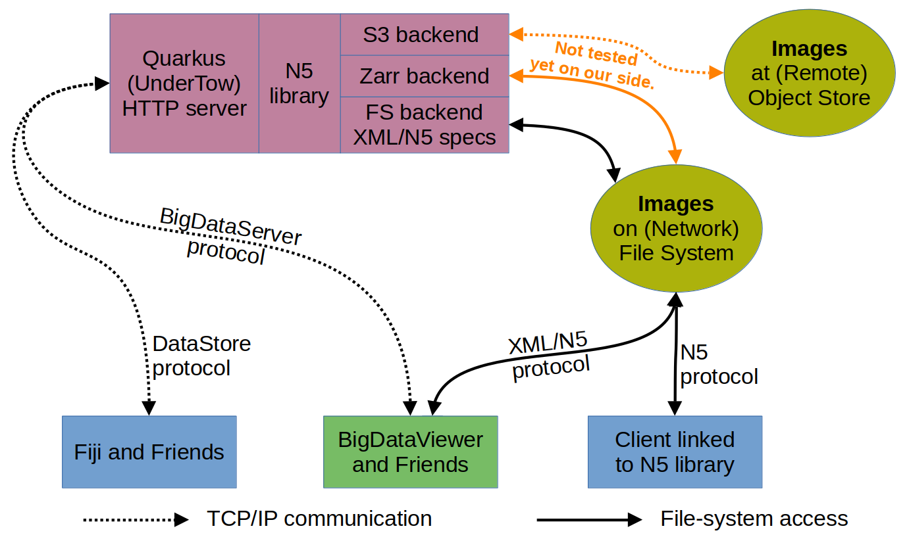

# Description
## Connection Scheme

## Storage Architecture

As hinted already, the server is by default using the N5 with the
[file-system backend](https://github.com/saalfeldlab/n5#file-system-specification).
It is worth mentioning, that any N5 client can work directly with the data (on the
file system, with out using the DataStore server at all), including the BigDataViewer.
Essentially, this is two ways to reach the same data.

It is, nevertheless, possible (thought not tested yet) to operate the server with the
[AWS-S3 backend](https://github.com/saalfeldlab/n5-aws-s3) in N5 and use the server as
a gateway to some S3 storage. In the later case, user's application may consume the S3
content ``directly'' via its [DataStore client](https://github.com/fiji-hpc/hpc-datastore-fiji)
and its connection to the DataStore server.

## Chunks

## Multi-resolution
So what exactly is being stored? In essence it is 3D blocks of voxels,
all of which together make up the image they are representing.
and the blocks shall ``factor'' the image they represent. That said,
the
all blocks of the same size (meaning the lengths along the three axes are preserved)

## Versions of Data

## N5, Zarr and NGFF

## Clients
We anticipate an ensemble of DataStore clients written in Java, Python and C++. At the
moment, we have a [reference Java client in the form of Fiji plugin](https://github.com/fiji-hpc/hpc-datastore-fiji).

### A Minimal Download Macro

### GUI Enhanced Download Macro
