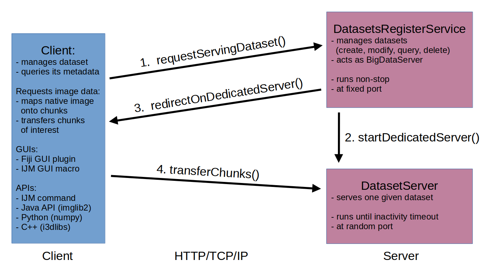

# Description
## Connection Scheme

## Storage Architecture
The figure below summarizes various ways to reach the same data.
Storage systems are in yellow circles, top right. These are where the image data is held.
The DataStore server is in purple, top left. Clients are listed at the bottom.
Dotted lines represent remote communication, while solid lines is for local communication
(which, just like in NFS or SAMBA, can be hiding network communication underneath).
Orange paths are technically possible but haven’t been explored yet. Thus, there are
no connection links drawn from the storage to match the orange paths.
But these paths are definitively worth exploring! In fact, we probably want to
deprecate the XML/N5 dialect, in favour of Zarr.

As hinted already, the server is by default using the [N5](https://github.com/saalfeldlab/n5)
with the [file-system backend](https://github.com/saalfeldlab/n5#file-system-specification),
in the XML/N5 dialect (explained just below). Considering only the images on the file system,
any N5 client that additionally understands the XML/N5 dialect can work directly with the data too.
Alternatively, the SPIM API may be used in the client (and pointed directly on the `export.xml`).
The BigDataViewer itself is the most prominent example of this approach.

The official way, however, is reaching the data via the DataStore server. Here, one can use
the BigDataViewer (or the underlying SPIM API) in [conjunction with the server](APPLICATIONS.md#bdv-mastodon-and-friends)
in place of the BigDataServer itself. Or, simply any [DataStore client](#clients), such as
the [convenient GUI client in Fiji](https://github.com/fiji-hpc/hpc-datastore-fiji), achieves
the same but in full-duplex.

Both options, direct access and via the DataStore server, offer equal full-fledged ways
to reach the same data.

It is, nevertheless, possible (thought not tested yet) to operate the server with the
[AWS-S3 backend](https://github.com/saalfeldlab/n5-aws-s3) in N5 and use the server as
a gateway to some S3 storage. The user's application may consume the S3 content
``transparently'' via its [DataStore client](https://github.com/fiji-hpc/hpc-datastore-fiji)
and its connection to the DataStore server.

### The BDV Dialect
In any case, N5 still needs to be instructed how to store the chunks--files. Currently,
we are doing it the XML/N5-way so that BigDataViewer can read the data directly.
This is what the layout may look like:

Notice the folder `export.n5` and the file `export.xml`, which is a typical sign for this N5 dialect.

## Chunks

## Multi-resolution
So what exactly is being stored? In essence it is 3D blocks of voxels,
all of which together make up the image they are representing.
and the blocks shall ``factor'' the image they represent. That said,
the
all blocks of the same size (meaning the lengths along the three axes are preserved)

## Versions of Data

## N5, Zarr and NGFF

## Clients
We anticipate an ensemble of DataStore clients written in Java, Python and C++. At the
moment, we have a [reference Java client in the form of Fiji plugin](https://github.com/fiji-hpc/hpc-datastore-fiji).

An [`imglib2`](https://imagej.net/libs/imglib2/) image data representation that would
be backed by the DataStore server is also on our road map. The would allow the image
processing developer to focus solely on implementing algorithms on `imglib2`, leaving
aside any DataStore client API.

### A Minimal Download Macro

### GUI Enhanced Download Macro
