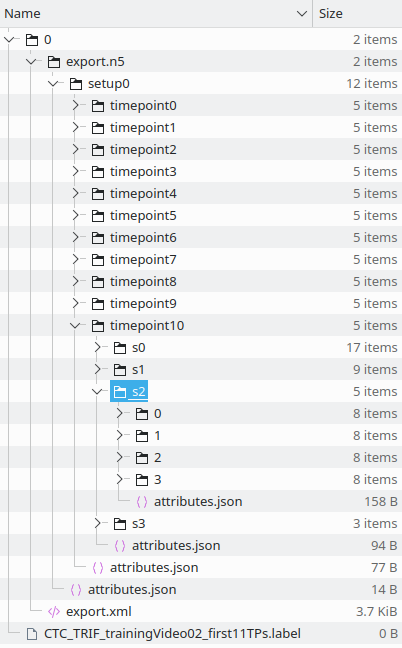

# Description
## Connection Scheme


## Storage Architecture
The figure below summarizes various ways to reach the same data.
Storage systems are in yellow circles, top right. These are where the image data is held.
The DataStore server is in purple, top left. Clients are listed at the bottom.
Dotted lines represent remote communication, while solid lines is for local communication
(which, just like in NFS or SAMBA, can be hiding network communication underneath).
Orange paths are technically possible but haven’t been explored yet. Thus, there are
no connection links drawn from the storage to match the orange paths.
But these paths are definitively worth exploring! In fact, we probably want to
deprecate the XML/N5 dialect, in favour of Zarr.


As hinted already, the server is by default using the [N5](https://github.com/saalfeldlab/n5)
with the [file-system backend](https://github.com/saalfeldlab/n5#file-system-specification),
in the XML/N5 dialect (explained just below). Considering only the images on the file system,
any N5 client that additionally understands the XML/N5 dialect can work directly with the data too.
Alternatively, the SPIM API may be used in the client (and pointed directly on the `export.xml`).
The BigDataViewer itself is the most prominent example of this approach.

The official way, however, is reaching the data via the DataStore server. Here, one can use
the BigDataViewer (or the underlying SPIM API) in [conjunction with the server](APPLICATIONS.md#bdv-mastodon-and-friends)
in place of the BigDataServer itself. Or, simply any [DataStore client](#clients), such as
the [convenient GUI client in Fiji](https://github.com/fiji-hpc/hpc-datastore-fiji), achieves
the same but in full-duplex.

Both options, direct access and via the DataStore server, offer equal full-fledged ways
to reach the same data.

It is, nevertheless, possible (thought not tested yet) to operate the server with the
[AWS-S3 backend](https://github.com/saalfeldlab/n5-aws-s3) in N5 and use the server as
a gateway to some S3 storage. The user's application may consume the S3 content
``transparently'' via its [DataStore client](https://github.com/fiji-hpc/hpc-datastore-fiji)
and its connection to the DataStore server.

### The BDV Dialect
In any case, N5 still needs to be instructed how to store the chunks--files. Currently,
we are doing it the XML/N5-way so that BigDataViewer can read the data directly.
This is what the layout may look like:



Notice the folder `export.n5` and the file `export.xml`, which is a typical sign for this N5 dialect.

## Chunks

## Multi-resolution
So what exactly is being stored? In essence it is 3D blocks of voxels,
all of which together make up the image they are representing.
and the blocks shall ``factor'' the image they represent. That said,
the
all blocks of the same size (meaning the lengths along the three axes are preserved)

## Versions of Data

## N5, Zarr and NGFF

## Clients
We anticipate an ensemble of DataStore clients written in Java, Python and C++. At the
moment, we have a [reference Java client in the form of Fiji plugin](https://github.com/fiji-hpc/hpc-datastore-fiji).

An [`imglib2`](https://imagej.net/libs/imglib2/) image data representation that would
be backed by the DataStore server is also on our road map. This would allow the image
processing developer to focus solely on implementing algorithms on `imglib2` -- like
it was always the case with `imglib2`, leaving the DataStore communication entirely up
to the particular (yet non-existent) `imglib2` storage backend.

For now, we are [collecting example ImageJ macros (`.ijm` files)](https://github.com/fiji-hpc/hpc-datastore-fiji/tree/master/src/main/ijm)
to show how various DataStore functionalities can be achieved in the batch processing mode of operation.

Worth mentioning is that most GUI Fiji plugins that implement DataStore client offer *Report corresponding
macro command* that would have done the same work. The reported command appears in the Fiji console
(Fiji menu: *Window* -> *Console*). One could then cut-and-paste it as such or as a template into own macros.

### A Minimal Download Macro
To download a particular chunk, block of chunks, or even full image, it is enough to insert one-liner command
into your Fiji macro. Well, it is a rather long one-liner, I agree. For example, the command

```
run("Read Into Image", "url=alfeios.fi.muni.cz:9080 datasetid=bd2e4ae0-64bb-48d7-8154-1c9846edbff6 versionasstr=latest resolutionlevelsasstr=[[4, 4, 4]] minx=0 maxx=249 miny=0 maxy=454 minz=0 maxz=242 timepoint=3 channel=0 angle=0 timeout=180000 verboselog=false showruncmd=false");
```

opens an ImageJ image specified in the command. We believe most of the parameters are self-explanatory,
except for which chunks are actually addressed. So, this information is hidden behind the
`resolutionlevelsasstr`, which provides a particular chunk size used for that resolution
level, and behind the `minx` and `maxx` (and of course also the `y`- and `z`-variants), which
defines the ROI in pixels w.r.t. the chosen resolution level and which gets ``rounded'' to the
smallest encompasing block of chunks. So, the fetched image may be larger than what was specified.

To download one chunk that contains pixel at pixel coordinates x,y,z, it is enough to set, e.g.,
`minx=x maxx=x` and also for the remaining axes. To download a full image, a `minx=0 maxx=999999`
works because the plugin internally narrows-down the requested interval to keep it within the
actual image size along each dimension.

We also provide convenience short-hand variants of reading and writing full images, e.g., `run("Read Full Image",...)`
but, at the moment, they don't function as *blocking* reads and writes.

In conclusion, it is enough to replace, e.g., `open('path/to/image.tif');` one-liner with the one above
to switch to using the DataStore. In this light, the DataStore could be understood as yet another image
file format.


### GUI Enhanced Download Macro
To turn a particular DataStore dataset into a series of TIFFs, we provide example macros with
explicit parameters for the operation and that can be harvested using a GUI dialog. For example:


[The macro is to be found here.](https://github.com/fiji-hpc/hpc-datastore-fiji/tree/master/src/main/ijm)
